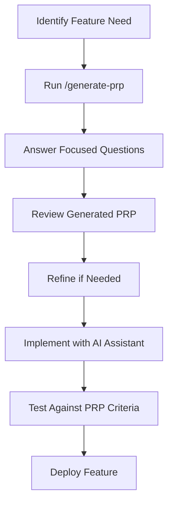

# 🎯 Generate PRP (Product Requirements Prompt) Command

I'll generate a comprehensive **Product Requirements Prompt (PRP)** for your feature development using automated research and intelligent context assembly.

## 🚀 Starting PRP Generation Process

Let me initialize the PRP generator and begin the interactive discovery process...

!node lib/prp-command-handler.js

## 🔍 What happens next:

1. **Interactive Feature Discovery** - I'll ask targeted questions about your feature
2. **Automated Codebase Analysis** - I'll analyze your project structure and tech stack  
3. **Live Web Research** - I'll research best practices and implementation patterns
4. **Document Generation** - I'll create a comprehensive PRP document
5. **File Output** - Your PRP will be saved to `generated-prps/` directory

---

## 📋 PRP Generation Features

## 🔍 PRP vs PRD Comparison

| **PRP (Product Requirements Prompt)** | **PRD (Product Requirements Document)** |
|-----------------------------------|----------------------------------|
| 🎯 **Feature-focused** | 📋 **Project-focused** |
| 🤖 **AI-optimized format** | 📄 **Human documentation** |
| ⚡ **Quick iteration** | 🏗️ **Comprehensive planning** |
| 🔧 **Implementation-ready** | 📊 **Strategic overview** |
| 🧠 **Context for AI assistants** | 👥 **Stakeholder communication** |

## 🚀 When to Use PRP

- 🆕 Adding a new feature to existing project
- 🔧 Refactoring a specific component
- 🐛 Bug fix with complex requirements
- ⚡ Rapid prototyping
- 🧪 Experimental features
- 🎨 UI/UX component development

## 🛠️ PRP Generation Process

**Important**: Focus on feature-based organization rather than time-based planning for AI-assisted development.

### 🏁 Step 1: Feature Discovery
Ask focused questions about:
- 🎯 **Feature Purpose**: What problem does this solve?
- 👥 **Target Users**: Who will use this feature?
- 🔗 **Integration Points**: How does it connect to existing code?
- ⚙️ **Technical Constraints**: What are the limitations?
- 🎨 **Design Requirements**: UI/UX considerations

### 🧠 Step 2: Context Assembly  
- 📂 Analyze existing codebase structure
- 🔍 Identify affected components
- 🔗 Map dependencies and interfaces
- 🛡️ Assess security implications
- 📊 Determine testing requirements

### 📝 Step 3: PRP Generation
Generate a structured prompt optimized for AI assistants containing:
- 🎯 Clear feature specification
- 🏗️ Technical implementation details
- 🧪 Test cases and acceptance criteria
- 🔗 Integration guidelines
- 🛡️ Security considerations

## 📋 PRP Template Structure

```markdown
# Feature: {Feature Name}

## 🎯 Context & Purpose
- **Problem Statement**: {Clear problem description}
- **Solution Overview**: {High-level solution approach}
- **Success Criteria**: {Measurable outcomes}

## 🏗️ Technical Implementation
- **Architecture**: {How it fits in existing system}
- **Dependencies**: {Required components/libraries}
- **Data Flow**: {Input → Processing → Output}
- **Performance**: {Requirements and considerations}

## 🧪 Testing Strategy
- **Unit Tests**: {Component-level testing}
- **Integration Tests**: {System integration points}
- **Edge Cases**: {Boundary conditions and error scenarios}
- **User Acceptance**: {Feature validation criteria}

## 🔗 Integration Guidelines
- **API Contracts**: {Interfaces and data formats}
- **Database Changes**: {Schema updates if needed}
- **Configuration**: {Environment variables/settings}
- **Deployment**: {Release considerations}

## 🛡️ Security & Compliance
- **Authentication**: {Auth requirements}
- **Authorization**: {Permission requirements}
- **Data Protection**: {Privacy and security measures}
- **Validation**: {Input validation rules}

## 📚 AI Assistant Context
- **Codebase**: {Relevant file paths and structures}
- **Patterns**: {Existing code patterns to follow}
- **Standards**: {Coding standards and conventions}
- **Tools**: {Development tools and frameworks}
```

## 💡 Usage Examples

### 🚀 Basic Usage
```bash
# Generate PRP for new feature
/generate-prp

# With feature name
/generate-prp --feature "User Authentication"

# For specific component
/generate-prp --component "PaymentProcessor"
```

### 🔧 Advanced Usage
```bash
# Include codebase analysis
/generate-prp --analyze-codebase --feature "Shopping Cart"

# Focus on specific area
/generate-prp --area frontend --feature "Product Search"

# Security-focused PRP
/generate-prp --security-review --feature "File Upload"
```

## 🎯 PRP Benefits

### 🤖 For AI Development
- **Focused Context**: AI gets exactly what it needs
- **Implementation Ready**: Can start coding immediately
- **Quality Assurance**: Built-in testing and validation
- **Consistency**: Follows established patterns

### 👥 For Human Developers
- **Clear Specifications**: Unambiguous requirements
- **Quick Reference**: Easy to scan and understand
- **Integration Guidance**: How to connect with existing code
- **Quality Gates**: Testing and validation checkpoints

## 🚀 Getting Started

1. 📁 **Navigate to your project directory**
2. 🎯 **Run `/generate-prp` and answer the focused questions**
3. 📝 **Review the generated PRP**
4. 🤖 **Use the PRP with Claude Code or other AI assistants**
5. 🔧 **Implement the feature following the specifications**

## 🔄 PRP Workflow Integration



---

---

*Document Version: 2.5.0*
*Generated by EchoContext Factory v2.5.0*
*Designed by Emmi C. (https://emmi.zone) - Built with Claude Code*

**🎯 Generate PRP Command v2.5.0**
*✨ Feature-focused requirements for AI-accelerated development*

This command generates AI-optimized Product Requirements Prompts for focused feature development within existing projects. 🚀